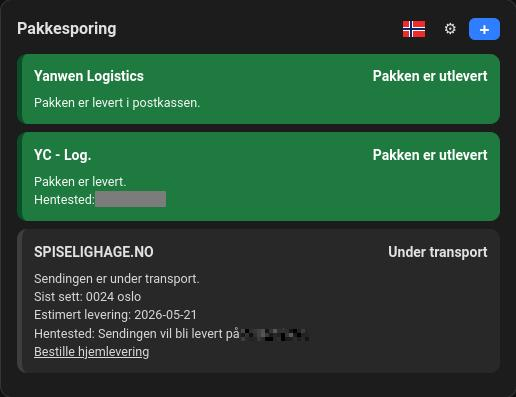
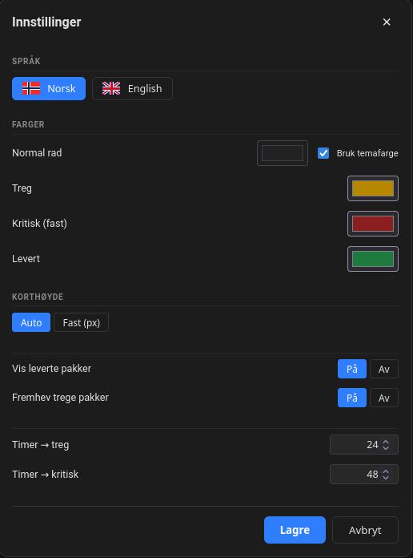

# Norwegian parcel tracker card

A Lovelace dashboard card for parcels tracked by [Norwegian parcel tracker](https://github.com/Homie-Assistance/norwegian-parcel-tracker).





## Installation with HACS

Add **this** repository as a HACS custom repository with category **Frontend**:

```text
https://github.com/Homie-Assistance/norwegian-parcel-tracker-card
```

HACS places the file at:

```text
www/community/norwegian-parcel-tracker-card/norwegian-parcel-tracker-card.js
```

And registers the Lovelace resource as:

```text
/local/community/norwegian-parcel-tracker-card/norwegian-parcel-tracker-card.js
```

> **Had the card installed from the old combined repo?**
> Remove that HACS entry (and its registered Lovelace resource) before installing from this repo.
> Otherwise HACS keeps updating the old `community/norwegian-parcel-tracker/` location and the
> new resource URL is never used.

## Manual installation (without HACS)

1. Copy `norwegian-parcel-tracker-card.js` to a subfolder under your HA `www/` directory:

   | HA install type | Destination |
   |---|---|
   | HassOS / HA OS | `/homeassistant/www/community/norwegian-parcel-tracker-card/norwegian-parcel-tracker-card.js` |
   | Docker | `/config/www/community/norwegian-parcel-tracker-card/norwegian-parcel-tracker-card.js` |

2. In **HA → Settings → Dashboards → Resources**, add the file as a **JavaScript module** with the URL:

   ```text
   /local/community/norwegian-parcel-tracker-card/norwegian-parcel-tracker-card.js
   ```

   Append `?v=1` (increment on each update) to bust the browser cache.

3. The `deploy.sh` script in this repo automates steps 1–2 and detects your install type automatically.

## Card configuration

```yaml
type: custom:norwegian-parcel-tracking
title: Pakker
show_delivered: false
highlight_stuck: true
```

## Features

- Lists all parcel tracking sensors from Norwegian parcel tracker.
- Shows latest event, estimated delivery, pickup point and location if available.
- Green for delivered parcels.
- Dark yellow for parcels not moving after 24 hours.
- Red for parcels not moving after 72 hours.
- Optional add-tracking-number field using the integration service.
